# Algo

## Overview

| Property | Value |
|----------|-------|
| Category | Library |
| Repository | StockSharp |
| Path | `Algo/Algo.csproj` |
| Project References | 3 |
| NuGet Dependencies | 6 |
| Consumers | 78 |

## Dependency Diagram

```mermaid
graph TD
    Algo["<strong>Algo</strong>"]
    Reporting["Reporting"]
    Algo --> Reporting
    Charting_Interfaces["Charting.Interfaces"]
    Algo --> Charting_Interfaces
    Configuration["Configuration"]
    Algo --> Configuration
    Algo_Testing["Algo.Testing"]
    Algo_Testing -.-> Algo
    Algo_Indicators["Algo.Indicators"]
    Algo_Indicators -.-> Algo
    Algo_Import["Algo.Import"]
    Algo_Import -.-> Algo
    01_Candles_Realtime_fromsrc["01_Candles.Realtime_fromsrc"]
    01_Candles_Realtime_fromsrc -.-> Algo
    01_Candles_Realtime["01_Candles.Realtime"]
    01_Candles_Realtime -.-> Algo
    02_Candles_CombineHistoryRealtime["02_Candles.CombineHistoryRealtime"]
    02_Candles_CombineHistoryRealtime -.-> Algo
    02_Candles_CombineHistoryRealtime_fromsrc["02_Candles.CombineHistoryRealtime_fromsrc"]
    02_Candles_CombineHistoryRealtime_fromsrc -.-> Algo
    04_Testing_HistoryConsole["04_Testing.HistoryConsole"]
    04_Testing_HistoryConsole -.-> Algo
    04_Testing_HistoryConsole_fromsrc["04_Testing.HistoryConsole_fromsrc"]
    04_Testing_HistoryConsole_fromsrc -.-> Algo
    02_Testing_Optimization["02_Testing.Optimization"]
    02_Testing_Optimization -.-> Algo
    02_Testing_Optimization_fromsrc["02_Testing.Optimization_fromsrc"]
    02_Testing_Optimization_fromsrc -.-> Algo
    01_Testing_History["01_Testing.History"]
    01_Testing_History -.-> Algo
    01_Testing_History_fromsrc["01_Testing.History_fromsrc"]
    01_Testing_History_fromsrc -.-> Algo
    03_Testing_RealTime_fromsrc["03_Testing.RealTime_fromsrc"]
    03_Testing_RealTime_fromsrc -.-> Algo
    03_Testing_RealTime["03_Testing.RealTime"]
    03_Testing_RealTime -.-> Algo
    more_consumers["... +63 more"]
    more_consumers -.-> Algo
```

## Project References
- Reporting
- Charting.Interfaces
- Configuration

## Consumed By
- Algo.Testing
- Algo.Indicators
- Algo.Import
- 01_Candles.Realtime_fromsrc
- 01_Candles.Realtime
- 02_Candles.CombineHistoryRealtime
- 02_Candles.CombineHistoryRealtime_fromsrc
- 04_Testing.HistoryConsole
- 04_Testing.HistoryConsole_fromsrc
- 02_Testing.Optimization
- 02_Testing.Optimization_fromsrc
- 01_Testing.History
- 01_Testing.History_fromsrc
- 03_Testing.RealTime_fromsrc
- 03_Testing.RealTime
- 06_Strategies.HistoryQuoting_fromsrc
- 06_Strategies.HistoryQuoting
- 04_Strategies.HistoryMarketRule
- 04_Strategies.HistoryMarketRule_fromsrc
- 08_Strategies.LiveArbitrage_fromsrc
- 08_Strategies.LiveArbitrage
- 03_Strategies.HistoryTrend_fromsrc
- 03_Strategies.HistoryTrend
- 05_Strategies.HistoryIndex_fromsrc
- 05_Strategies.HistoryIndex
- 10_Strategies.LiveTerminal
- 10_Strategies.LiveTerminal_fromsrc
- 07_Strategies.LiveSpread
- 07_Strategies.LiveSpread_fromsrc
- 02_Strategies.HistoryBollingerBands
- 02_Strategies.HistoryBollingerBands_fromsrc
- 01_Strategies.HistorySMA_fromsrc
- 01_Strategies.HistorySMA
- 09_Strategies.LiveOptionsQuoting_fromsrc
- 09_Strategies.LiveOptionsQuoting
- 05_Storage.HydraServerSaveToLocal_fromsrc
- 05_Storage.HydraServerSaveToLocal_fromsrc
- 05_Storage.HydraServerSaveToLocal
- 04_Storage.HydraServerConnect_fromsrc
- 04_Storage.HydraServerConnect
- 02_Storage.Local
- 02_Storage.Local_fromsrc
- 02_Storage.Local_fromsrc
- 01_Storage.Random_fromsrc
- 01_Storage.Random_fromsrc
- 01_Storage.Random
- 03_Storage.RemoteSource_fromsrc
- 03_Storage.RemoteSource_fromsrc
- 03_Storage.RemoteSource
- 01_CrossPlatform.ConsoleApp_fromsrc
- 01_CrossPlatform.ConsoleApp_fromsrc
- 01_CrossPlatform.ConsoleApp
- 01_Misc.Logging_fromsrc
- 01_Misc.Logging
- 02_Misc.Unit
- 02_Misc.Unit_fromsrc
- 01_Advanced.MultiConnect_fromsrc
- 01_Advanced.MultiConnect
- 02_Advanced.SaveDataLocal_fromsrc
- 02_Advanced.SaveDataLocal
- 03_Indicators.CreateOwn
- 03_Indicators.CreateOwn_fromsrc
- 01_Indicators.SimpleSMA
- 01_Indicators.SimpleSMA_fromsrc
- 02_Indicators.ComplexBollinger
- 02_Indicators.ComplexBollinger_fromsrc
- 02_Basic.MarketDepths_fromsrc
- 02_Basic.MarketDepths
- 03_Basic.Orders_fromsrc
- 03_Basic.Orders
- 01_Basic.ConnectAndDownloadInstruments
- 01_Basic.ConnectAndDownloadInstruments_fromsrc
- 02_Chart.ActiveOrders
- 02_Chart.ActiveOrders_fromsrc
- 01_Chart_fromsrc
- 01_Chart
- 03_Chart.Performance_fromsrc
- 03_Chart.Performance

## External NuGet Packages
| Package | Version |
|---------|---------||
| MathNet.Numerics | 6.0.0-beta2 |

## Internal NuGet Packages
| Package | Version |
|---------|---------|
| Ecng.Net | 1.0.* |
| Ecng.IO.Compression | 1.0.* |
| Ecng.StringSearch | 1.0.* |
| Ecng.Compilation | 1.0.* |
| Ecng.Linq | 1.0.* |

## Data Access Patterns
### IMessageAdapter
| File | Line | Context |
|------|------|---------||
| `Algo/Positions/PositionMessageAdapter.cs` | 6 | `public class PositionMessageAdapter : MessageAdapterWrapper` |
| `Algo/OrderLogMessageAdapter.cs` | 10 | `public class OrderLogMessageAdapter(IMessageAdapter innerAdapter) : Me` |
| `Algo/FilteredMarketDepthAdapter.cs` | 10 | `public class FilteredMarketDepthAdapter(IMessageAdapter innerAdapter) ` |
| `Algo/Slippage/SlippageMessageAdapter.cs` | 11 | `public class SlippageMessageAdapter(IMessageAdapter innerAdapter, ISli` |
| `Algo/AssociatedSecurityAdapter.cs` | 10 | `public class AssociatedSecurityAdapter(IMessageAdapter innerAdapter) :` |
| `Algo/SnapshotHolderMessageAdapter.cs` | 185 | `public class SnapshotHolderMessageAdapter : MessageAdapterWrapper` |
| `Algo/Latency/LatencyMessageAdapter.cs` | 11 | `public class LatencyMessageAdapter(IMessageAdapter innerAdapter, ILate` |
| `Algo/OfflineMessageAdapter.cs` | 6 | `public class OfflineMessageAdapter : MessageAdapterWrapper` |
| `Algo/BasketSecurityMessageAdapter.cs` | 13 | `public class BasketSecurityMessageAdapter(IMessageAdapter innerAdapter` |
| `Algo/TraderHelper.cs` | 1083 | `where TAdapter : IMessageAdapter` |
| `Algo/SubscriptionMessageAdapter.cs` | 9 | `public class SubscriptionMessageAdapter : MessageAdapterWrapper` |
| `Algo/OrderBookIncrementMessageAdapter.cs` | 6 | `public class OrderBookIncrementMessageAdapter : MessageAdapterWrapper` |
| `Algo/SubscriptionSecurityAllMessageAdapter.cs` | 10 | `public class SubscriptionSecurityAllMessageAdapter(IMessageAdapter inn` |
| `Algo/Level1ExtendBuilderAdapter.cs` | 10 | `public class Level1ExtendBuilderAdapter(IMessageAdapter innerAdapter) ` |
| `Algo/Candles/Compression/CandleHolderMessageAdapter.cs` | 10 | `public class CandleHolderMessageAdapter(IMessageAdapter innerAdapter) ` |

*... and 19 more*

---

*[Back to Index](../index.md)*
