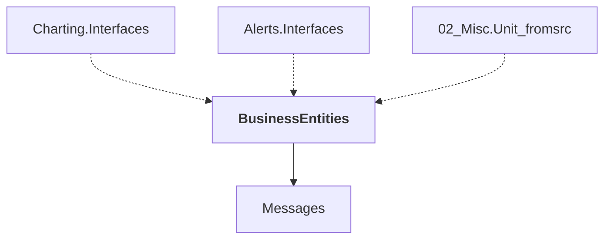

# BusinessEntities

## Overview

| Property | Value |
|----------|-------|
| Category | Library |
| Repository | StockSharp |
| Path | `BusinessEntities/BusinessEntities.csproj` |
| Project References | 1 |
| NuGet Dependencies | 2 |
| Consumers | 3 |

## Dependency Diagram

## Project References
- Messages

## Consumed By
- Charting.Interfaces
- Alerts.Interfaces
- 02_Misc.Unit_fromsrc

## Internal NuGet Packages
| Package | Version |
|---------|---------|
| Ecng.Configuration | 1.0.* |
| Ecng.Drawing | 1.0.* |

---

*[Back to Index](../index.md)*
