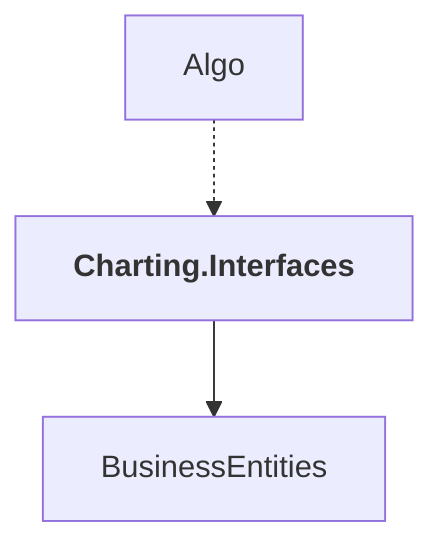

# Charting.Interfaces

## Overview

| Property | Value |
|----------|-------|
| Category | Library |
| Repository | StockSharp |
| Path | `Charting.Interfaces/Charting.Interfaces.csproj` |
| Project References | 1 |
| NuGet Dependencies | 0 |
| Consumers | 1 |

## Dependency Diagram

## Project References
- BusinessEntities

## Consumed By
- Algo

---

*[Back to Index](../index.md)*
