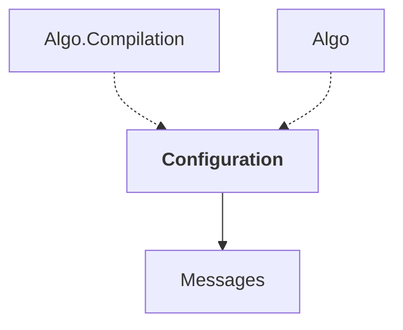

# Configuration

## Overview

| Property | Value |
|----------|-------|
| Category | Library |
| Repository | StockSharp |
| Path | `Configuration/Configuration.csproj` |
| Project References | 1 |
| NuGet Dependencies | 2 |
| Consumers | 2 |

## Dependency Diagram

## Project References
- Messages

## Consumed By
- Algo.Compilation
- Algo

## External NuGet Packages
| Package | Version |
|---------|---------||
| NuGet.Configuration | 7.0.1 |

## Internal NuGet Packages
| Package | Version |
|---------|---------|
| Ecng.Configuration | 1.0.* |

---

*[Back to Index](../index.md)*
