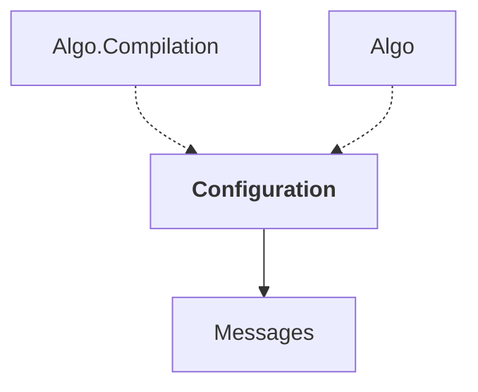

# Configuration

## Overview

| Property | Value |
|----------|-------|
| Category | Library |
| Repository | StockSharp |
| Path | `Configuration/Configuration.csproj` |
| Project References | 1 |
| NuGet Dependencies | 2 |
| Consumers | 2 |

## Dependency Diagram

## Project References
- Messages

## Consumed By
- Algo.Compilation
- Algo

## External NuGet Packages
| Package | Version |
|---------|---------||
| NuGet.Configuration | 7.0.1 |

## Internal NuGet Packages
| Package | Version |
|---------|---------|
| Ecng.Configuration | 1.0.* |

## Data Access Patterns
### Redis.Write
| File | Line | Context |
|------|------|---------||
| `Configuration/Permissions/PermissionCredentials.cs` | 49 | `.Set("Permission", p.Key)` |
| `Configuration/Permissions/PermissionCredentials.cs` | 50 | `.Set("Settings", p.Value` |
| `Configuration/Permissions/PermissionCredentials.cs` | 53 | `.Set("Name", p1.Key.name)` |
| `Configuration/Permissions/PermissionCredentials.cs` | 54 | `.Set("Param", p1.Key.param)` |
| `Configuration/Permissions/PermissionCredentials.cs` | 55 | `.Set("Extra", p1.Key.extra)` |
| `Configuration/Permissions/PermissionCredentials.cs` | 56 | `.Set("Till", p1.Key.till)` |
| `Configuration/Permissions/PermissionCredentials.cs` | 57 | `.Set("IsEnabled", p1.Value)` |
| `Configuration/AppStartSettings.cs` | 51 | `.Set(nameof(Language), Language)` |
| `Configuration/AppStartSettings.cs` | 52 | `.Set(nameof(Online), Online)` |
| `Configuration/AppStartSettings.cs` | 53 | `.Set(nameof(TimeZone), TimeZone.Id)` |
| `Configuration/SubscriptionConfig.cs` | 79 | `.Set(nameof(Security), Security?.ToStringId())` |
| `Configuration/SubscriptionConfig.cs` | 80 | `.Set(nameof(DataType), DataType?.ToSerializableString())` |
| `Configuration/SubscriptionConfig.cs` | 81 | `.Set(nameof(BuildMode), BuildMode)` |
| `Configuration/SubscriptionConfig.cs` | 82 | `.Set(nameof(BuildFrom), BuildFrom?.ToSerializableString())` |
| `Configuration/SubscriptionConfig.cs` | 83 | `.Set(nameof(BuildField), BuildField)` |

*... and 4 more*

### Redis.Read
| File | Line | Context |
|------|------|---------||
| `Configuration/ITransactionIdStorage.cs` | 144 | `ISessionTransactionIdStorage ITransactionIdStorage.Get(string sessionI` |
| `Configuration/ITransactionIdStorage.cs` | 195 | `ISessionTransactionIdStorage ITransactionIdStorage.Get(string sessionI` |

---

*[Back to Index](../index.md)*
