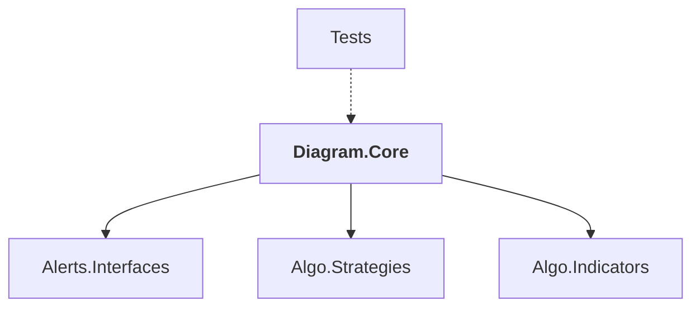

# Diagram.Core

## Overview

| Property | Value |
|----------|-------|
| Category | Library |
| Repository | StockSharp |
| Path | `Diagram.Core/Diagram.Core.csproj` |
| Project References | 3 |
| NuGet Dependencies | 0 |
| Consumers | 1 |

## Dependency Diagram

## Project References
- Alerts.Interfaces
- Algo.Strategies
- Algo.Indicators

## Consumed By
- Tests

---

*[Back to Index](../index.md)*
