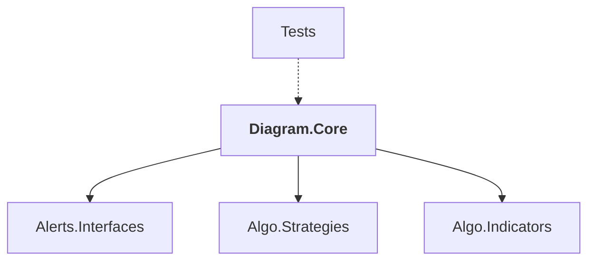

# Diagram.Core

## Overview

| Property | Value |
|----------|-------|
| Category | Library |
| Repository | StockSharp |
| Path | `Diagram.Core/Diagram.Core.csproj` |
| Project References | 3 |
| NuGet Dependencies | 0 |
| Consumers | 1 |

## Dependency Diagram

## Project References
- Alerts.Interfaces
- Algo.Strategies
- Algo.Indicators

## Consumed By
- Tests

## Data Access Patterns
### Kafka.Consumer
| File | Line | Context |
|------|------|---------||
| `Diagram.Core/Elements/SecurityIndexDiagramElement.cs` | 105 | `Strategy.Subscribe(new(new SecurityLookupMessage { SecurityId = id }))` |
| `Diagram.Core/Elements/SubscriptionDiagramElement.cs` | 91 | `Strategy.Subscribe(_subscription);` |

### Redis.Write
| File | Line | Context |
|------|------|---------||
| `Diagram.Core/Elements/IndicatorDiagramElement.cs` | 174 | `.Set(nameof(t.Id), t.Id);` |
| `Diagram.Core/Elements/IndicatorDiagramElement.cs` | 262 | `.Set(PatternName, pattern.Name)` |
| `Diagram.Core/Elements/IndicatorDiagramElement.cs` | 263 | `.Set(Pattern, pattern.SaveEntire(false))` |
| `Diagram.Core/Elements/SyncDiagramElement.cs` | 329 | `storage.Set(_inKey, _map` |
| `Diagram.Core/Elements/SyncDiagramElement.cs` | 332 | `.Set(nameof(s.Id), s.Id)` |
| `Diagram.Core/Elements/SyncDiagramElement.cs` | 333 | `.Set(nameof(s.Type), s.Type.Type.GetTypeAsString(false))` |
| `Diagram.Core/Elements/AlertDiagramElement.cs` | 84 | `.Set(nameof(c.Id), c.Id)` |
| `Diagram.Core/Elements/CrossingDiagramElement.cs` | 97 | `_currentValues.Set(sock.GetValue<Unit>(true), sock.Socket == _input1);` |
| `Diagram.Core/ICompositionRegistry.cs` | 114 | `container.Set(Keys.Version, _minVersion.ToString());` |
| `Diagram.Core/ICompositionRegistry.cs` | 118 | `container.Set(Keys.Scheme, settings);` |
| `Diagram.Core/ICompositionRegistry.cs` | 128 | `.Set(Keys.Encrypted, true)` |
| `Diagram.Core/ICompositionRegistry.cs` | 129 | `.Set(Keys.Scheme, encryptedStr);` |
| `Diagram.Core/ICompositionRegistry.cs` | 191 | `.Set(nameof(element.SchemaVersion), element.SchemaVersion)` |
| `Diagram.Core/ICompositionRegistry.cs` | 192 | `.Set(nameof(element.Category), element.Category)` |
| `Diagram.Core/ICompositionRegistry.cs` | 193 | `.Set(nameof(element.DocUrl), element.DocUrl)` |

*... and 18 more*

### MongoDB.Read
| File | Line | Context |
|------|------|---------||
| `Diagram.Core/Elements/LogicalConditionDiagramElement.cs` | 203 | `result = bools.Aggregate((a, b) => a ^ b);` |

---

*[Back to Index](../index.md)*
