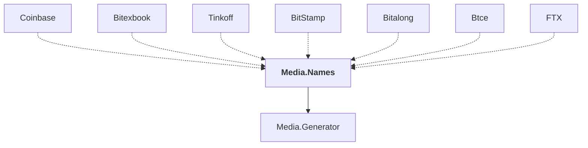

# Media.Names

## Overview

| Property | Value |
|----------|-------|
| Category | Library |
| Repository | StockSharp |
| Path | `Media.Names/Media.Names.csproj` |
| Project References | 1 |
| NuGet Dependencies | 0 |
| Consumers | 7 |

## Dependency Diagram

## Project References
- Media.Generator

## Consumed By
- Coinbase
- Bitexbook
- Tinkoff
- BitStamp
- Bitalong
- Btce
- FTX

---

*[Back to Index](../index.md)*
