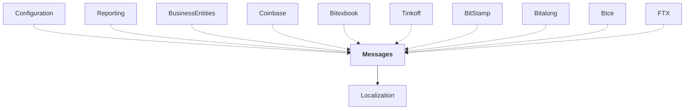

# Messages

## Overview

| Property | Value |
|----------|-------|
| Category | Library |
| Repository | StockSharp |
| Path | `Messages/Messages.csproj` |
| Project References | 1 |
| NuGet Dependencies | 2 |
| Consumers | 10 |

## Dependency Diagram

## Project References
- Localization

## Consumed By
- Configuration
- Reporting
- BusinessEntities
- Coinbase
- Bitexbook
- Tinkoff
- BitStamp
- Bitalong
- Btce
- FTX

## Internal NuGet Packages
| Package | Version |
|---------|---------|
| Ecng.Logging | 1.0.* |
| Ecng.Linq | 1.0.* |

## Data Access Patterns
### IMessageAdapter
| File | Line | Context |
|------|------|---------||
| `Messages/ChannelMessageAdapter.cs` | 6 | `public class ChannelMessageAdapter : MessageAdapterWrapper` |
| `Messages/MessageAdapter.cs` | 8 | `public abstract partial class MessageAdapter : BaseLogReceiver, IMessa` |
| `Messages/IMessageAdapterWrapper.cs` | 6 | `public interface IMessageAdapterWrapper : IMessageAdapter` |
| `Messages/Extensions.cs` | 1521 | `where TAdapter : IMessageAdapter` |
| `Messages/Extensions.cs` | 1541 | `where TAdapter : IMessageAdapter` |
| `Messages/HistoricalMessageAdapter.cs` | 10 | `public abstract class HistoricalMessageAdapter(IdGenerator transaction` |

---

*[Back to Index](../index.md)*
