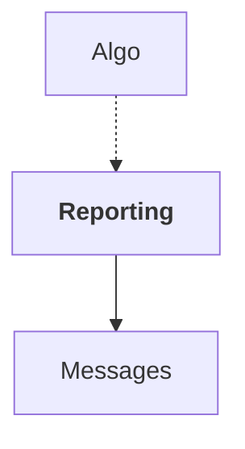

# Reporting

## Overview

| Property | Value |
|----------|-------|
| Category | Library |
| Repository | StockSharp |
| Path | `Reporting/Reporting.csproj` |
| Project References | 1 |
| NuGet Dependencies | 1 |
| Consumers | 1 |

## Dependency Diagram

## Project References
- Messages

## Consumed By
- Algo

## Internal NuGet Packages
| Package | Version |
|---------|---------|
| Ecng.Excel | 1.0.* |

---

*[Back to Index](../index.md)*
